# Zero Trust Certificate-Based Authentication


## Hybrid Identity Architecture (Cloud / Solution Architect Lab)

## At a glance

| | |
| --- | --- |
| **Outcome** | Passwordless Microsoft Entra sign-in using on-premises **user** authentication certificates |
| **Scope** | **User** certificate-based authentication (CBA) — not machine/device certificate authentication |
| **Environment** | Windows Server 2022 lab (AD DS, AD CS, Entra Connect) + Microsoft Entra ID tenant |
| **Status** | Lab validated — see [Lab Validation](#lab-validation) |
| **Type** | Architectural proof of concept (not a step-by-step tutorial) |

---

## Table of Contents

- [At a glance](#at-a-glance)
- [Executive Summary](#executive-summary)
- [Business Impact](#business-impact)
- [Delivery Scope](#delivery-scope)
- [Technology Stack](#technology-stack)
- [Reference Framework](#reference-framework)
- [Architectural Goals](#architectural-goals)
- [Architectural Assumptions](#architectural-assumptions)
- [Architecture Overview](#architecture-overview)
- [Authentication Flow (High Level)](#authentication-flow-high-level)
- [Prerequisites](#prerequisites)
- [Lab Topology Used](#lab-topology-used)
- [Lab Validation](#lab-validation)
- [Lab Screenshots](#lab-screenshots)
- [PKI Design Decisions](#pki-design-decisions)
- [Entra ID Integration Strategy](#entra-id-integration-strategy)
- [Conditional Access – Architectural Design](#conditional-access--architectural-design)
- [Zero Trust Alignment](#zero-trust-alignment)
- [Threat Model](#threat-model)
- [Security & Risk Considerations](#security--risk-considerations)
- [Production Hardening Checklist](#production-hardening-checklist)
- [Trade-offs & Limitations](#trade-offs--limitations)
- [Key Architectural Takeaways](#key-architectural-takeaways)
- [Skills Demonstrated](#skills-demonstrated)
- [References](#references)
- [Intended Audience](#intended-audience)
- [Disclaimer](#disclaimer)

## Executive Summary

This project presents the design and implementation of a **hybrid identity
architecture** leveraging **certificate-based authentication (CBA)** to enable
**Zero Trust access** in a cloud-integrated environment.

The solution demonstrates how **identity becomes the primary control plane**
by integrating an on-premises PKI with Microsoft Entra ID to deliver
**passwordless, phishing-resistant authentication**.

This lab is positioned as an **architectural proof of concept**, not a
step-by-step tutorial.

The design is aligned to the **Microsoft Zero Trust model**, using **user
identity** and policy enforcement as the primary decision points rather than
network location. **Device trust** (compliance, health attestation) is out of
scope for this lab and would be a separate layer in a full Zero Trust rollout.

---

## Business Impact

This architecture is designed to reduce reliance on passwords, lower exposure to
credential theft, and improve authentication assurance in hybrid environments.
From a business perspective, it demonstrates how stronger identity controls can
improve security posture, support compliance objectives, and reduce friction for
users through passwordless access.

---

## Delivery Scope

### What Was Built vs What Is Conceptual

| Area                                 | Status         | Notes                                                                           |
| ------------------------------------ | -------------- | ------------------------------------------------------------------------------- |
| On-premises PKI with AD CS           | **Built**      | Enterprise Root CA used to issue user authentication certificates               |
| User certificate issuance            | **Built**      | X.509 certificates represent the primary authentication factor                  |
| Microsoft Entra ID certificate trust | **Built**      | Root CA trust imported and mapped to cloud identities                           |
| Certificate-Based Authentication     | **Built**      | Passwordless sign-in flow implemented as the main authentication design         |
| Conditional Access enforcement       | **Conceptual** | Policy intent documented, but implementation depends on licensing               |
| Production-grade PKI hierarchy       | **Conceptual** | Lab uses a simplified single-tier CA rather than a hardened offline-root design |

This distinction makes the project scope explicit: the repository demonstrates a
working hybrid identity trust model, while also documenting how it would mature
in a production environment.

---

## Technology Stack

| Layer              | Technologies                                                     |
| ------------------ | ---------------------------------------------------------------- |
| Identity           | Microsoft Entra ID, Active Directory Domain Services             |
| PKI                | Active Directory Certificate Services, X.509 certificates        |
| Authentication     | Certificate-Based Authentication, UPN/SAN-based identity mapping |
| Hybrid Integration | Microsoft Entra Connect, on-premises Root CA trust import        |
| Access Control     | Conditional Access design, least privilege principles            |
| Architecture Model | Microsoft Zero Trust model                                       |

---

## Reference Framework

This project uses the **Microsoft Zero Trust model** as the reference framework
behind the architecture.

### How the Design Maps to the Model

| Microsoft Zero Trust pillar | Implementation in this project                                                                  |
| --------------------------- | ----------------------------------------------------------------------------------------------- |
| **Identities**              | Microsoft Entra ID acts as the identity control plane; **user** CBA replaces password-based sign-in |
| **Devices**                 | **Out of scope.** A domain-joined workstation is used only to enroll and present the **user** certificate; device compliance (Intune, etc.) is not implemented |
| **Applications**            | Access is granted to protected resources only after identity verification and policy evaluation |
| **Infrastructure**          | On-premises AD CS provides the trust anchor for hybrid certificate issuance                     |
| **Data**                    | Authentication strength is increased before access to cloud resources is issued                 |
| **Network**                 | Network location is explicitly de-emphasised in favour of identity-driven access decisions      |

This framing makes the repository easier for recruiters and hiring managers to
evaluate against a recognised Microsoft security architecture model.

---

## Architectural Goals

- Replace password-based authentication with strong cryptographic identity
- Extend on-prem identity trust into the cloud
- Apply Zero Trust principles independently of network location
- Design a scalable and secure authentication model for hybrid environments
- Balance security, complexity, and operational cost

---

## Architectural Assumptions

- Users are domain-joined and can enroll **user** authentication certificates (not machine certificates)
- Certificates are stored in the **user** profile on a client workstation used to initiate sign-in
- PKI trust is properly distributed between on-premises AD CS and Microsoft Entra ID
- Entra ID licensing supports Conditional Access (future state)

> **Lab scope:** This project validates **user-to-cloud** authentication. It does not implement computer authentication, device certificates, or device compliance policies.

---

## Architecture Overview

This lab implements **user** certificate-based authentication to Microsoft Entra ID.
Certificates are issued to **users** via AD CS user templates — not to computers for
machine authentication.

### Logical Architecture

- **Identity Provider**: Microsoft Entra ID
- **Trust Anchor**: On-Premises Public Key Infrastructure (PKI)
- **Authentication Method**: User Certificate-Based Authentication (CBA)
- **Access Control Plane**: Conditional Access (design-level)

### Components

#### On-Premises

- Active Directory Domain Services
- Active Directory Certificate Services (Enterprise Root CA)
- User authentication certificates (X.509)

#### Cloud

- Microsoft Entra ID (Azure AD)
- Microsoft Entra Connect (identity synchronization layer between AD DS and Entra ID)
- Certificate-Based Authentication
- Conditional Access policies (conceptual)

### Identity Source of Authority

In this architecture, Active Directory remains the authoritative identity source.
Microsoft Entra ID acts as the policy enforcement and authentication control plane.

Identity synchronization is performed using Microsoft Entra Connect.

---

## Authentication Flow (High Level)

1. User presents an X.509 certificate during authentication
2. Entra ID validates the certificate chain against a trusted Root CA
3. Certificate attributes (UPN / SAN) are mapped to the cloud identity
4. Entra ID issues an authentication token
5. Access is granted based on Zero Trust evaluation

This flow removes dependency on passwords and reduces attack surface.

### Architecture Diagram

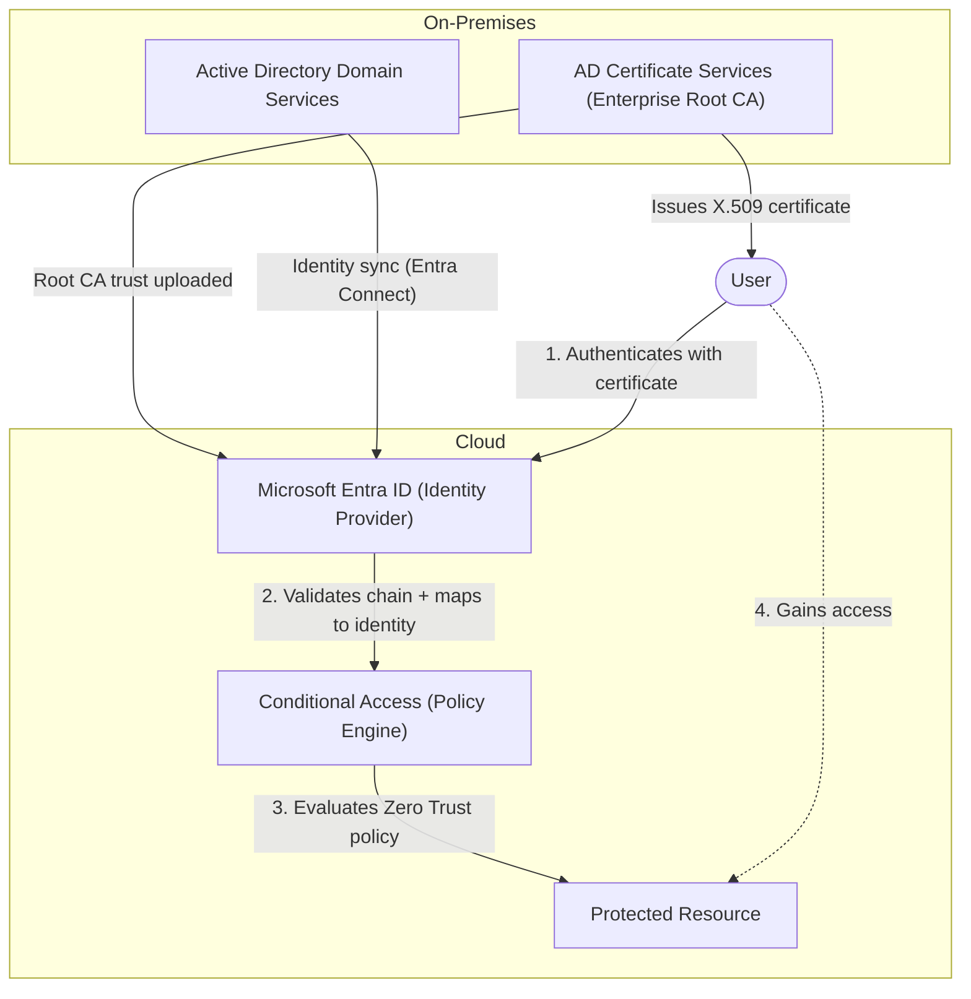

---

## Prerequisites

To reproduce this lab, you will need:

- A Windows Server with Active Directory Domain Services
- Active Directory Certificate Services installed and configured
- Microsoft Entra ID tenant with a routable domain available
- Microsoft Entra Connect configured for hybrid identity synchronization
- A user account that can enroll certificates and sign in with certificate-based authentication
- Access to the Active Directory Users and Computers console for UPN updates

---

## Lab Topology Used

For this lab, the environment was split across dedicated Windows Server 2022 roles to align with best practices as closely as possible:

- **AD:** `DomainController`
- **PKI:** `PKIServer.ark.sec`
- **AD sync:** `ADSync.ark.sec`
- **Workstation:** `WindowsClient.ark.sec`

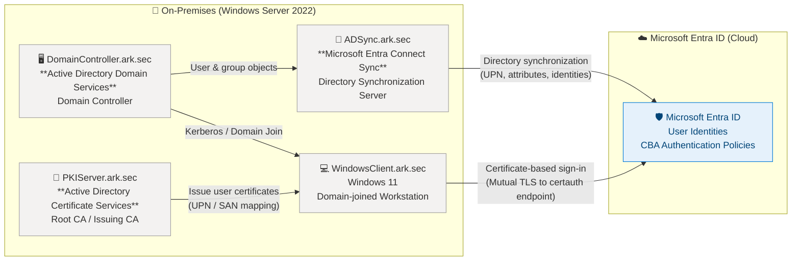

---

## Lab Validation

This lab is considered successful when the following conditions are met:

- The on-premises Root CA is installed and operational
- A user certificate can be issued and used for authentication
- The routable domain `razakoukoni.site` is added to Microsoft Entra ID
- The alternative UPN suffix is configured in on-premises AD Domains and Trusts
- The affected user(s) show the updated UPN in Active Directory and Entra ID
- Microsoft Entra Connect has synchronized the user successfully
- Certificate-based authentication is enabled in Microsoft Entra ID
- A successful sign-in event is recorded in the Entra sign-in logs

The validation was executed on the following lab hosts:

- `DomainController`
- `PKIServer.ark.sec`
- `ADSync.ark.sec`
- `WindowsClient.ark.sec`

---

## Lab Screenshots

The following screenshots capture the most relevant milestones from the lab so the README can serve as both an architecture summary and an evidence trail. Click on pictures to enlarge them.

### 1. On-premises AD and AD CS setup

**AD Users and Computers**

This shows the on-premises Active Directory environment used as the identity source for the lab.

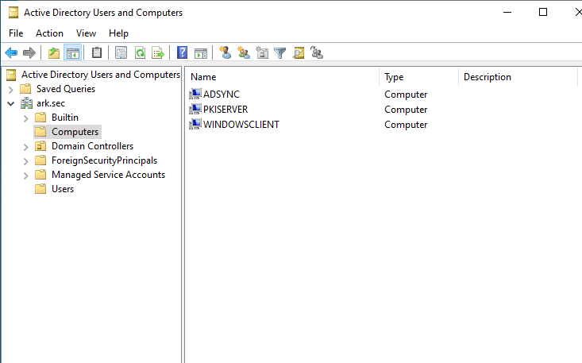

**AD CS installation**

This confirms that Active Directory Certificate Services is installed on the lab server.

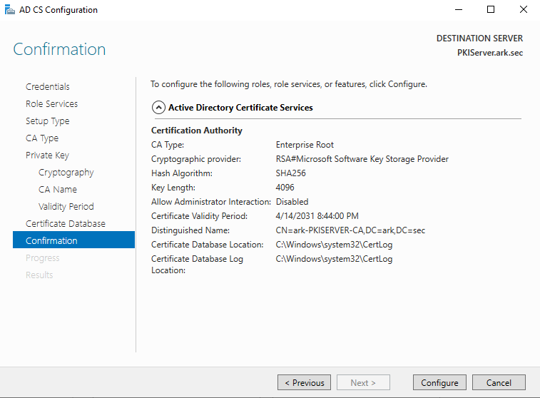

**CA configured**

This shows the enterprise CA is configured and ready to issue certificates.

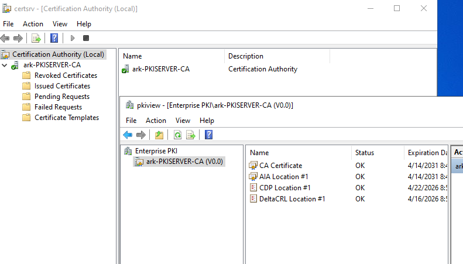

### 2. Certificate template and issuance

**Certificate template EKU**

This captures the EKU settings required for user authentication certificates.

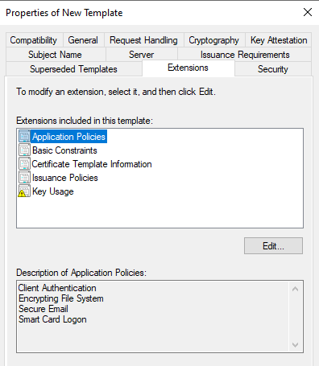

**Certificate template subject name**

This shows the subject name configuration used for certificate issuance.

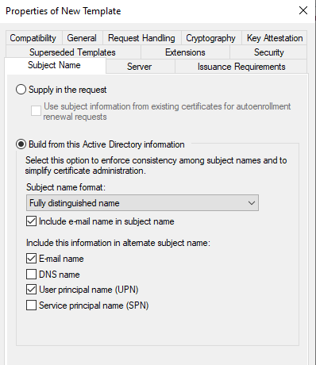

**Certificate template published**

This confirms the template has been published and is available for enrollment.

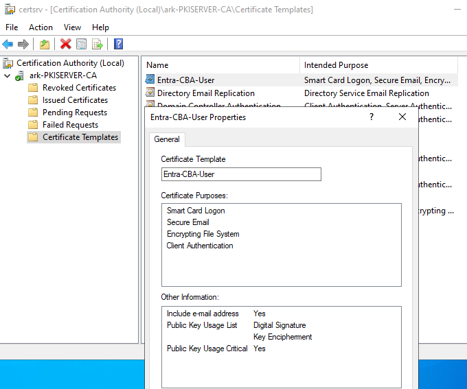

**Issued certificate**

This is the user certificate issued during the lab, which is used for authentication.

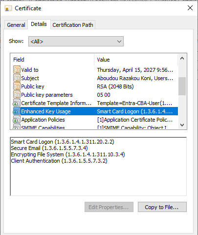

### 3. UPN suffix and user logon name updates

**Add routable domain in AD UPN**

This shows the alternative UPN suffix being added in Active Directory Domains and Trusts.

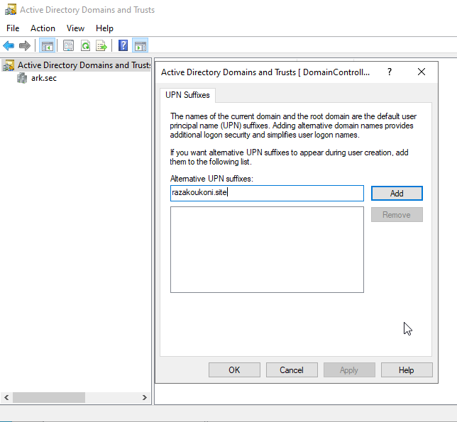

**Update user UPN**

This captures the user logon name change from `@ark.sec` to `@razakoukoni.site`.

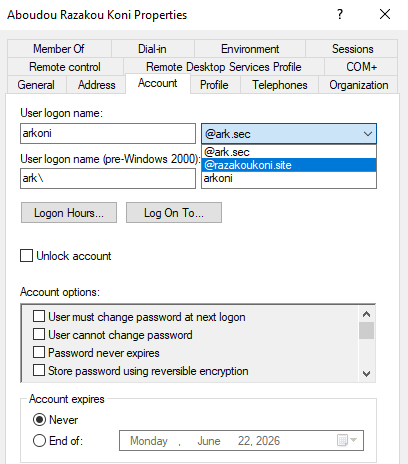

**Certificate reissued after UPN update**

This confirms the certificate was reissued after the UPN change so the identity remains aligned.

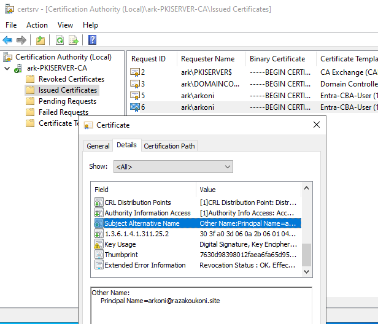

### 4. Entra ID integration and synchronization

**CBA enabled in Microsoft Entra ID**

This shows certificate-based authentication enabled in the Entra ID tenant.

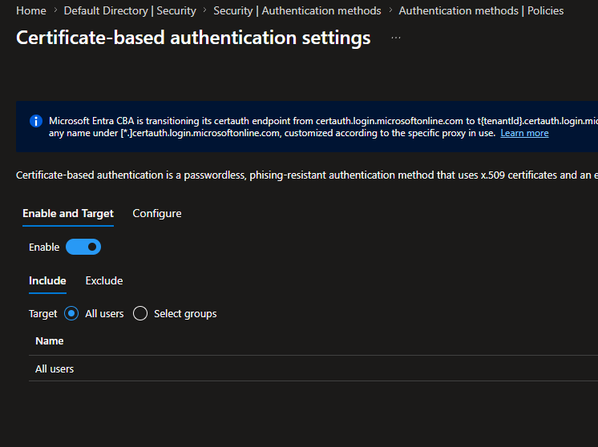

**Microsoft Entra Connect configuration**

This captures the Entra Connect settings used to synchronize the on-premises identity.

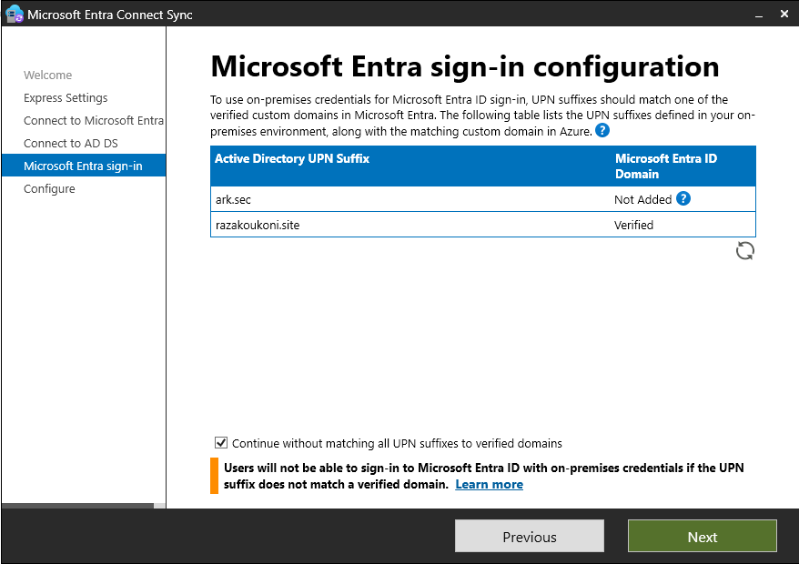

**Synchronized Microsoft Entra user**

This confirms the user exists in Microsoft Entra ID after synchronization.

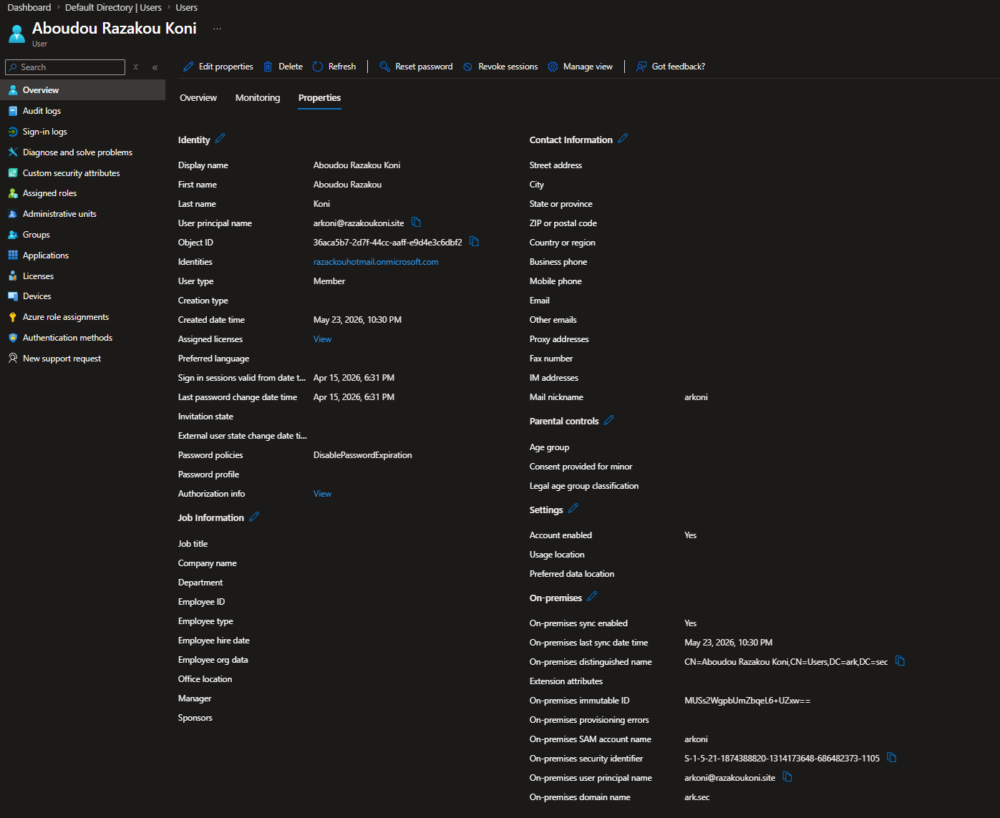

**Root CA added to Microsoft Entra ID**

This shows the Root CA trust being added so Entra ID can validate the certificate chain.

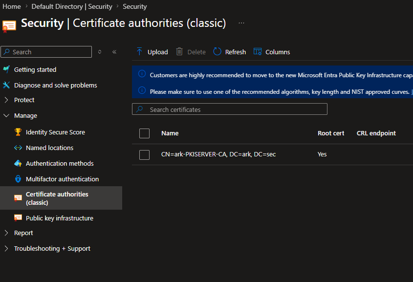

**Certificate mapping configuration**

This demonstrates how the certificate attributes are mapped to the cloud identity.

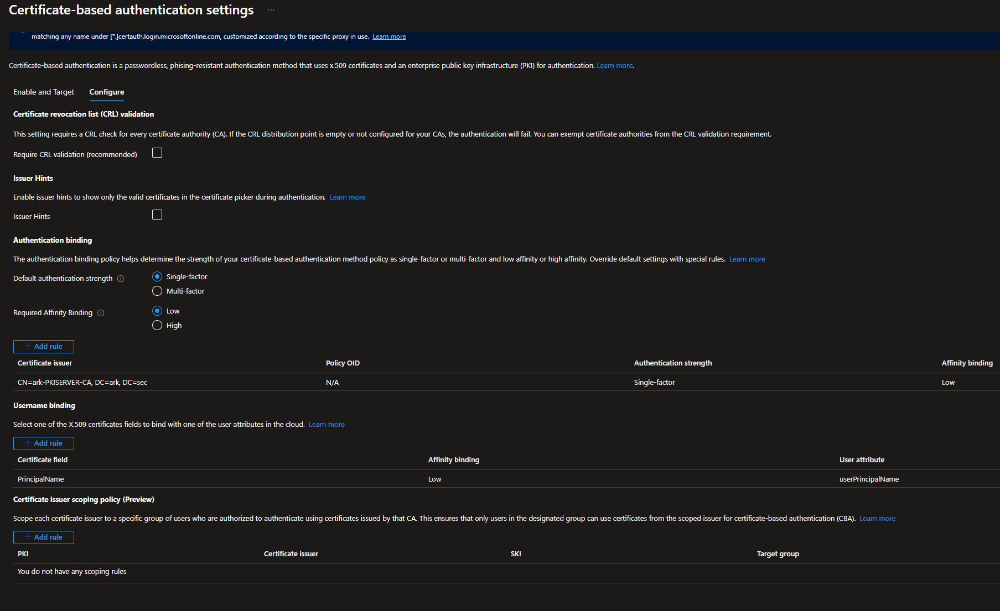

### 5. Validation and sign-in evidence

**Testing flow**

This is the end-to-end validation flow confirming the lab is working as expected.

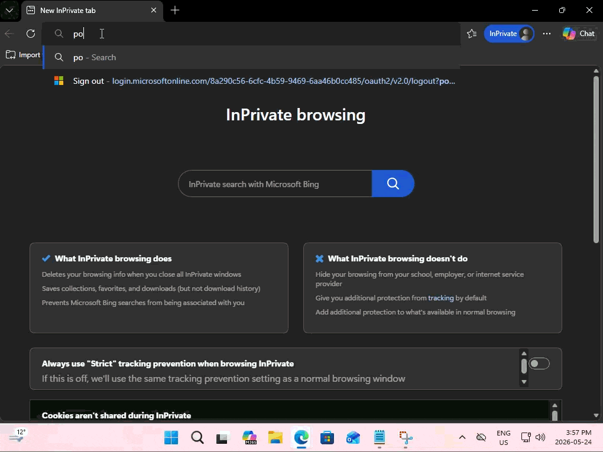

**Microsoft Entra sign-in log**

This is the sign-in evidence showing the authentication event recorded in Microsoft Entra ID.

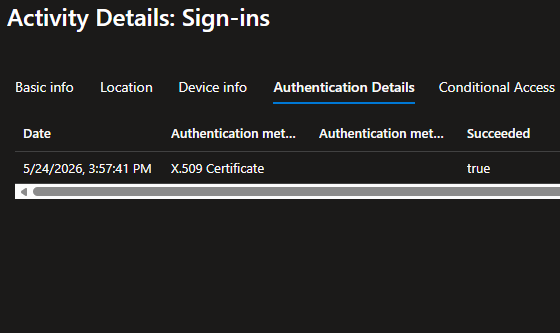

---

## PKI Design Decisions

### Why an Enterprise PKI?

- Centralized identity governance
- Strong binding between user and credential
- Compatibility with cloud identity providers
- Support for lifecycle management (issuance, renewal, revocation)

### Design Choices

- Single-tier Enterprise Root CA (lab scope)
- User-based authentication certificates
- AD-integrated certificate templates
- Group-based enrollment control

> In a production environment, this design would typically evolve into a
> multi-tier PKI with an offline Root CA.

---

## Entra ID Integration Strategy

### Certificate-Based Authentication

Microsoft Entra **user** CBA validates a certificate presented by the user during
cloud sign-in. It does not authenticate the **device** as a managed or compliant
endpoint.

- Root CA certificate imported into Entra ID
- Certificate trust chain validation
- Attribute-based certificate mapping to **user** identities (UPN / SAN)

### Domain and UPN Notes

- The on-premises local domain `ark.sec` is **not routable**.
- To ensure a routable identity namespace for cloud authentication, I added the routable domain `razakoukoni.site` to Microsoft Entra ID and then configured it as an alternative UPN suffix in on-premises AD Domains and Trusts.
- This allows cloud identities to use a routable UPN while preserving the on-premises AD forest for hybrid identity operations.
- For this lab, I also updated the **User Properties → Account → User logon name** value in Active Directory Users and Computers so the UPN changed from `@ark.sec` to `@razakoukoni.site` for the affected user.

### Bulk UPN Update Script

If you need to update multiple users in the lab, the following PowerShell script can change the UPN suffix from `@ark.sec` to `@razakoukoni.site` for all users that currently use the old suffix.

```powershell
# Requires Active Directory module
Import-Module ActiveDirectory

$oldSuffix = "@ark.sec"
$newSuffix = "@razakoukoni.site"

Get-ADUser -Filter { UserPrincipalName -like "*$oldSuffix" } | ForEach-Object {
    $newUpn = $_.UserPrincipalName.Replace($oldSuffix, $newSuffix)
    Set-ADUser -Identity $_.DistinguishedName -UserPrincipalName $newUpn
    Write-Host "Updated $($_.SamAccountName): $($newUpn)"
}
```

If you want to target only a specific set of users, replace the filter with a list of `SamAccountName` values.

### Architectural Benefits

- Phishing-resistant authentication
- Elimination of shared secrets
- Reduced dependency on MFA prompts
- Improved user experience with strong security guarantees

---

## Conditional Access – Architectural Design

Conditional Access is used as the **policy enforcement layer**.

### Intended Controls

- Require certificate-based authentication for all users
- Block legacy authentication methods
- Enforce access decisions based on identity strength
- Apply least privilege and explicit verification

Due to licensing constraints, policies are documented conceptually,
reflecting a **production-ready design**.

> _Never trust, always verify._

---

## Zero Trust Alignment

This solution aligns with core Zero Trust principles for **user** access:

- **Identity is the new perimeter** — user CBA strengthens the identity pillar
- **Never trust, always verify** — Entra validates the certificate chain and mapping on every sign-in
- **Passwordless and phishing-resistant access** — no password is used for Entra sign-in in this lab
- **Strong authentication over network trust** — sign-in assurance comes from cryptography, not corporate network location
- **Continuous evaluation before access** — Conditional Access is the intended policy layer (conceptual in the lab)

**Device trust** would be added in a later phase (for example Intune compliance plus
Conditional Access). This lab intentionally stops at **user** authentication.

Zero Trust is not a product — it is an **identity-driven architecture**.

---

## Threat Model

### Threat model scope

This threat model applies to **Microsoft Entra ID user sign-in via certificate-based
authentication**. It does **not** cover:

- **Machine or device authentication** (no device certificates, no Intune compliance checks)
- **On-premises Kerberos** or other domain protocols that may still exist alongside cloud CBA
- **Full endpoint compromise** scenarios where an attacker can use a stolen user certificate from the victim's profile

Within that scope, the architecture is designed to defeat or mitigate the following attack categories:

| Threat                                      | Mitigation (within CBA user sign-in scope)                                                                 |
| ------------------------------------------- | ---------------------------------------------------------------------------------------------------------- |
| **Phishing / credential theft (cloud)**     | No password is used for Entra sign-in; authentication is bound to the user's certificate                   |
| **Pass-the-hash / pass-the-ticket (cloud)** | Not applicable to Entra CBA sign-in — no password hash is presented to Entra for this flow               |
| **Credential stuffing (cloud)**             | No shared secrets for Entra sign-in — no password to enumerate or replay                                   |
| **Man-in-the-middle (sign-in channel)**     | Mutual TLS to the Entra certificate authentication endpoint; no password secret crosses the wire           |
| **Lateral movement via stolen cloud creds** | Disable user account or revoke certificate; reissue after UPN or identity changes (revocation is simplified in the lab) |
| **Legacy protocol abuse (cloud)**           | Conditional Access design blocks legacy authentication methods (conceptual in this lab)                  |

**Out of scope for this lab:** Kerberos ticket theft on domain-joined machines, stolen
user certificates from a compromised workstation, and device posture attacks. A
production design would combine user CBA with device compliance, monitoring, and
on-premises hardening.

### Trust Boundary

The explicit trust boundary is the **user** certificate chain anchored at the
on-premises Root CA. Entra ID will not issue an authentication token without valid
chain validation and confirmed mapping of certificate attributes (UPN / SAN) to a
synchronized **user** identity.

---

## Security & Risk Considerations

- Certificate lifecycle management is critical
- PKI introduces operational complexity that must be governed
- Revocation strategy must be defined in production
- Monitoring and logging are required for auditability
- Certificate revocation is not real-time in cloud authentication scenarios and must be carefully considered in production designs

These aspects are acknowledged and intentionally simplified for the lab scope.

---

## Production Hardening Checklist

Use this checklist when evolving the lab design toward production. Items marked
**(lab gap)** are intentionally simplified or not implemented in this repository.

### PKI

- [ ] Deploy a **two-tier hierarchy** with an offline Root CA and online issuing CA
- [ ] Publish **CRL** and/or **OCSP** for certificate revocation **(lab gap)**
- [ ] Define certificate **lifetime**, renewal, and reissuance procedures (especially after UPN changes)
- [ ] Restrict enrollment with **group-based** template permissions and approval workflows
- [ ] Use **user** authentication templates only — separate machine templates if device auth is required later
- [ ] Monitor CA health, issuance logs, and failed requests

### Identity and certificates

- [ ] Enforce **routable UPNs** for all cloud-authenticating users
- [ ] Document Entra **certificate mapping** rules (issuer + SAN / UPN) and test after template changes
- [ ] Plan for **account disable** as a rapid containment control when revocation latency is a concern
- [ ] Automate bulk UPN migration with change control (see [Bulk UPN Update Script](#bulk-upn-update-script))

### Microsoft Entra ID

- [ ] Enable and test **certificate-based authentication** in production pilot groups before broad rollout
- [ ] Implement **Conditional Access** requiring phishing-resistant authentication strength
- [ ] Block **legacy authentication** protocols
- [ ] Retain **sign-in logs** and alerting for anomalous certificate-based sign-ins

### Device trust (future layer — out of lab scope)

- [ ] Add **Intune** device compliance and Conditional Access requiring compliant devices
- [ ] Do not treat user CBA as a substitute for device posture — combine both in a full Zero Trust design

### Operations and governance

- [ ] Document runbooks for issuance, renewal, revocation, and incident response
- [ ] Assign PKI and identity ownership (IAM ops vs security architecture)
- [ ] Schedule periodic **access reviews** and template audits

---

## Trade-offs & Limitations

### Design Trade-offs

| Decision                            | Benefit                                       | Cost                                                                      |
| ----------------------------------- | --------------------------------------------- | ------------------------------------------------------------------------- |
| Single-tier Root CA                 | Simplicity; appropriate for lab scope         | Not suitable for production; offline Root CA required                     |
| AD-integrated certificate templates | Automated enrollment, centralised governance  | Dependency on AD health and availability                                  |
| CBA without MFA prompts             | Improved user experience with strong security | Requires high confidence in certificate issuance and lifecycle management |
| Conceptual Conditional Access       | Full design documented without licensing cost | Policies are not enforced in this lab environment                         |

### Known Limitations

- Lab environment — not hardened for production use
- **User authentication only** — no device certificates, device compliance, or machine authentication
- No certificate revocation infrastructure (CRL / OCSP) deployed
- Conditional Access policies are design-level only due to licensing constraints
- Single-tier PKI; production would require a two-tier hierarchy with an offline Root CA

These constraints are intentional and allow focus on **hybrid user identity and trust design**.

---

## Key Architectural Takeaways

- PKI remains a foundational trust mechanism in modern cloud architectures
- Certificate-based authentication enables true passwordless Zero Trust
- Hybrid identity requires explicit trust modeling between on-prem and cloud
- Security architecture decisions must balance risk, usability, and cost

---

## Skills Demonstrated

| Domain                         | Skills                                                                                          |
| ------------------------------ | ----------------------------------------------------------------------------------------------- |
| **PKI & Cryptography**         | AD Certificate Services, CA hierarchy design, X.509 certificate templates, lifecycle management |
| **Hybrid Identity**            | Microsoft Entra ID, Active Directory, Entra Connect, cross-boundary trust modeling              |
| **Zero Trust Architecture**    | Identity-centric security design, perimeter elimination, explicit verification                  |
| **Authentication**             | Certificate-Based Authentication (CBA), passwordless auth, phishing-resistant MFA               |
| **Access Control**             | Conditional Access policy design, least privilege, legacy auth blocking                         |
| **Security Architecture**      | Threat modeling, risk assessment, security trade-off analysis                                   |
| **Architecture Communication** | Executive summaries, Mermaid diagrams, design rationale, audience-appropriate documentation     |

---

## References

Official Microsoft documentation relevant to this lab:

- [Overview of certificate-based authentication in Microsoft Entra ID](https://learn.microsoft.com/en-us/entra/identity/authentication/concept-certificate-based-authentication)
- [How to configure certificate-based authentication](https://learn.microsoft.com/en-us/entra/identity/authentication/how-to-certificate-based-authentication)
- [Microsoft Entra Connect sync](https://learn.microsoft.com/en-us/entra/identity/hybrid/connect/whatis-azure-ad-connect-v2)
- [Deploy an enterprise certification authority](https://learn.microsoft.com/en-us/windows-server/networking/core-network-guide/cncg/server-certs/server-certificate-deployment)
- [Microsoft Zero Trust deployment plan overview](https://learn.microsoft.com/en-us/security/zero-trust/deploy/overview)

---

## Intended Audience

- Cloud Architects
- Solution Architects
- Identity & Access Management Architects
- Security Architects

---

## Disclaimer

This repository is a technical demonstration and architectural study.
No production credentials or sensitive configuration data are included.
